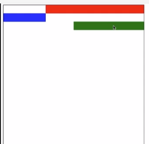

# Web布局

### 布局的基本概念

普通文档流：

- 从左到右
- 从上到下

### CSS flex布局

#### 一、flex容器上的属性

- flex-direction
- flex-wrap
- flex-flow
- justify-content
- align-items

#### 二、flex容器上的属性

- flex-basis

- flex-grow

  ​	剩余空间的分配比例，不指定时分配比例默认为0（元素不会自动填充剩余	空间）

- flex-shrink

  ​	溢出空间的分配比例，不指定时分配比例默认为1（所有元素等比例压缩）

- flex

#### 三、flex布局的应用

1、实现导航栏（多个元素在同一行）

​	方法一：display: inline-block。将所有元素变成行内块元素

​	方法二：display: flex。flex容器会自动将内部元素放在一行排列

2、拆分导航，导航栏标题在最左边，个人头像在最右边（两端对齐）

​	justify-content: space-between

3、元素居中

4、绝对底部

​	正文设置flex-grow: 1。由正文撑开剩余空间。

### CSS 一般布局

#### 一、定位 position

1、相对定位 position: relative	

​	相对于父元素进行偏移

2、绝对定位 position: absolute

​	从父元素往上至根元素为止，找到第一个值不为static的元素，相对于该元素进	行偏移（父元素都不指定时默认为static，会相对根元素进行偏移）

3、固定定位  position: fixed

​	相对于可视窗口进行偏移（与父元素无关）

4、粘性定位 position: sticky

​	静态时相当于relative，当页面滚动到一定位置时变成fixed固定定位

#### 二、浮动 float

##### 清除浮动

一个元素浮动后，会影响到它后面好几个元素的定位，可以用clear清除浮动

clear：left | right | both (清除左边、右边、两边的浮动影响)

对浮动后面的元素使用clear，就可以使该元素免受前面浮动的影响

### Web布局实验

#### 如何实现聊天内容左右分布

方法一：左右浮动

方法二：flex布局。调整每个元素上的align-self属性，设置值为flex-start与flex-end。（在交叉轴上的对齐方式）

### 响应式布局

#### 如何实现响应式布局

- 设置meta（为了视图大小与屏幕大小一致）
- 媒体查询
- 合理使用长度单位

#### 长度单位

- rem

  根元素的字体大小

- 百分比

- 视口单位vh、vw、vmin、vmax

  视口高度、视口宽度、两者中的较小者、两者中的较大者

#### 合理使用长度单位

- 移动端屏幕一般用rem

- 需要占满宽度的元素%优于vw

  因为vw包含了滚动条的宽度，会比实际宽度大一点

- 需要占满高度的元素vh优于%

  因为%一般需要设置父元素的高度，而vh不用